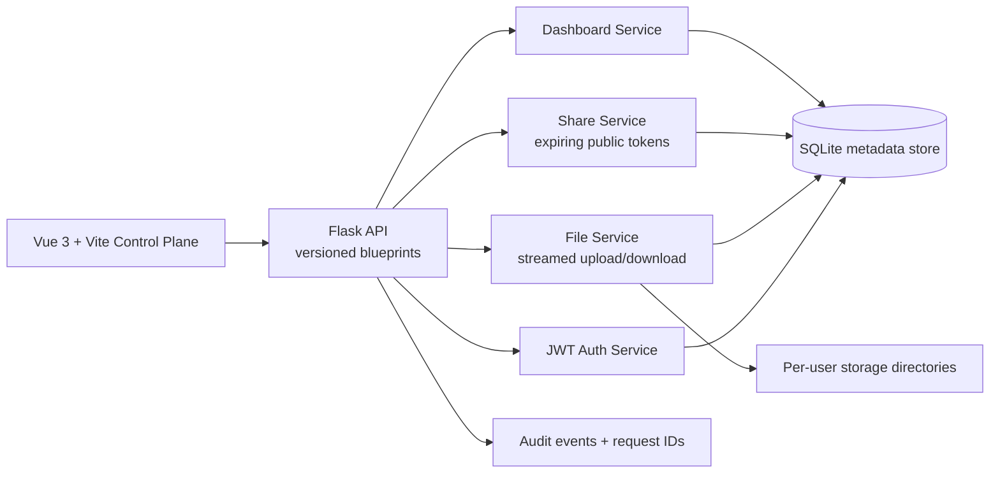
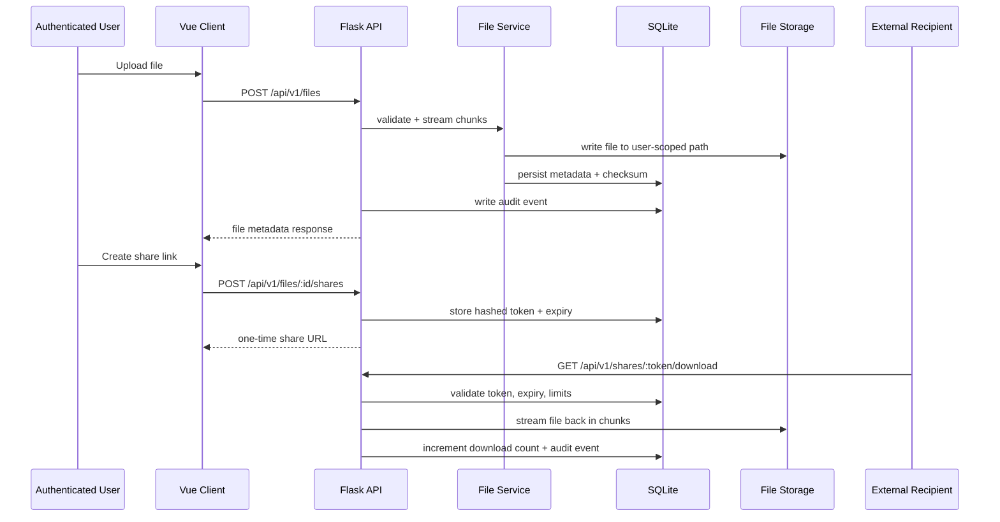

# VaultFlow Secure File Transfer

VaultFlow is a secure file transfer control plane for authenticated uploads, governed file sharing, and auditable external downloads.

## Why It Matters

Teams often need to share sensitive files outside their organization without emailing attachments, exposing internal credentials, or losing visibility into who downloaded what. VaultFlow addresses that gap: controlled transfer, expiring access, and operational visibility in a lightweight system designed to feel production-aware.

What makes it technically interesting:

- Uploads and downloads stream in chunks instead of buffering entire files in memory
- External recipients get time-limited access without requiring full user accounts
- File ownership, share policies, and audit events stay consistent across the lifecycle
- The system includes enough operational signals to feel debuggable and extensible

## Features

- JWT-authenticated workspace for upload, download, delete, and dashboard actions
- Expiring share links with hashed tokens, download limits, and revocation
- Streamed transfer paths with SHA-256 checksums and ownership-scoped storage
- Audit feed and transfer metrics for user activity and file lifecycle visibility
- Rate limiting on login and upload paths to make abuse controls explicit

## Stack

| Layer           | Technologies                                                   |
| --------------- | -------------------------------------------------------------- |
| Backend         | Flask, Flask-JWT-Extended, SQLAlchemy, SQLite                  |
| Frontend        | Vue 3, Vue Router, Vite, Axios                                 |
| Auth & Transfer | JWT, expiring share links, checksum validation, request IDs    |
| Dev Workflow    | PowerShell launcher, Docker Compose, backend integration tests |

## System Diagram



## Architecture

VaultFlow separates request handling from orchestration. Flask blueprints define the API surface, service modules own transfer and auth logic, SQLAlchemy stores metadata and audit events, and file bytes are persisted on disk in user-scoped directories.

Key modules:

- `backend/app/api` — versioned HTTP endpoints
- `backend/app/services` — auth, transfer, share, dashboard, rate-limit, and audit orchestration
- `backend/app/models.py` — `User`, `FileRecord`, `ShareLink`, and `AuditEvent`
- `frontend/src/composables/useTransferWorkspace.js` — frontend workflow orchestration
- `frontend/src/components/workspace` — auth, upload, share, file table, and activity UI

### Request Flow



### Design Decisions

- **App-factory Flask backend** — keeps config, testing, and route registration explicit.
- **Service-oriented modules** — separates HTTP transport from transfer and share logic.
- **One-time token return** — the plain token is only returned on creation; only the hash is stored.
- **Streamed transfer path** — upload and download operate on chunks to avoid loading whole files into memory.
- **User-scoped storage layout** — each user owns an isolated storage subtree to simplify access control reasoning.
- **Vite frontend** — improves local startup speed and keeps client tooling modern and lightweight.

### Tradeoffs

- SQLite keeps the project easy to run and reason about, but is not the right persistence layer for high-write concurrent workloads.
- Local disk storage makes the transfer path concrete and inspectable; object storage would be a better fit for scale and durability.
- In-memory rate limiting is simple and dependency-light; distributed deployments would need Redis or a shared limiter.
- Server-side encryption is the current baseline; full envelope encryption with per-file data keys is the next hardening step.

## Failure Handling

- Invalid or expired JWTs return structured `401` responses.
- Expired, revoked, or overused share links are rejected before file streaming begins.
- Upload size limits are enforced server-side.
- Login and upload rate limits slow down noisy clients and brute-force attempts.
- Responses include request IDs to make debugging easier across client and server logs.

## Repo Layout

```text
secure-file-transfer/
├── backend/
│   ├── app/
│   │   ├── api/
│   │   ├── core/
│   │   ├── services/
│   │   ├── utils/
│   │   ├── __init__.py
│   │   ├── extensions.py
│   │   └── models.py
│   ├── tests/
│   ├── .env.example
│   ├── Dockerfile
│   ├── requirements.txt
│   └── run.py
├── frontend/
│   ├── src/
│   │   ├── components/
│   │   ├── composables/
│   │   ├── router/
│   │   ├── services/
│   │   ├── styles/
│   │   └── views/
│   ├── .env.example
│   ├── Dockerfile
│   ├── package.json
│   └── vite.config.js
├── scripts/
│   └── New-DemoFiles.ps1
├── docker-compose.yml
└── Start-VaultFlow.ps1
```

## API Routes

| Method | Route                              | Description                     |
| ------ | ---------------------------------- | ------------------------------- |
| POST   | `/api/v1/auth/register`            | Create account                  |
| POST   | `/api/v1/auth/login`               | Authenticate and receive JWT    |
| GET    | `/api/v1/health`                   | Health check                    |
| GET    | `/api/v1/dashboard`                | Transfer metrics and summary    |
| GET    | `/api/v1/files`                    | List user files                 |
| POST   | `/api/v1/files`                    | Upload file (streamed)          |
| GET    | `/api/v1/files/<file_id>/download` | Download owned file             |
| POST   | `/api/v1/files/<file_id>/shares`   | Create expiring share link      |
| GET    | `/api/v1/shares/<token>/download`  | Public download via share token |
| DELETE | `/api/v1/shares/<share_link_id>`   | Revoke share link               |
| DELETE | `/api/v1/files/<file_id>`          | Delete file                     |

## Run It

### Quickstart

```powershell
.\Start-VaultFlow.ps1
```

Default local URLs:

- Frontend: `http://localhost:8081`
- Backend API: `http://localhost:5001`

### Manual Setup

Backend:

```powershell
cd backend
python -m venv venv
venv\Scripts\activate
pip install -r requirements.txt
copy .env.example .env
python run.py
```

Frontend:

```powershell
cd frontend
npm install
copy .env.example .env
npm run dev
```

### Docker

```bash
docker compose up --build
```

### Demo Walkthrough

Generate sample files, then walk through the core flow:

```powershell
.\scripts\New-DemoFiles.ps1
```

1. Start the stack and register a new account in the UI.
2. Upload one of the generated files from `demo-files` and observe checksum and metadata.
3. Create an expiring share link and copy it.
4. Open the link in an incognito window to simulate an external recipient.
5. Revoke the share or exhaust its download budget and verify the link is rejected.
6. Refresh the dashboard to see download count and audit activity update.

## Environment Configuration

Backend defaults: [backend/.env.example](./backend/.env.example)
Frontend defaults: [frontend/.env.example](./frontend/.env.example)

Key backend settings:

- `APP_SECRET_KEY`, `JWT_SECRET_KEY`
- `PORT`, `MAX_CONTENT_LENGTH_MB`
- `DEFAULT_SHARE_LINK_TTL_MINUTES`
- `LOGIN_RATE_LIMIT_ATTEMPTS`, `UPLOAD_RATE_LIMIT_REQUESTS`
- `PUBLIC_BASE_URL`, `CORS_ALLOWED_ORIGINS`

Key frontend settings:

- `VITE_API_BASE_URL`, `VITE_PROXY_TARGET`

## What's Next

- Replace local disk with S3-compatible object storage
- Replace SQLite with Postgres (migrations are already in place via Alembic)
- Move rate limiting to Redis for distributed enforcement
- Upgrade to full envelope encryption with per-file data keys and KMS wrapping
- Add resumable uploads and partial-download support
- Add distributed tracing (OpenTelemetry) and Prometheus metrics exporters
- Add background workers for scanning, retention policies, and notifications
