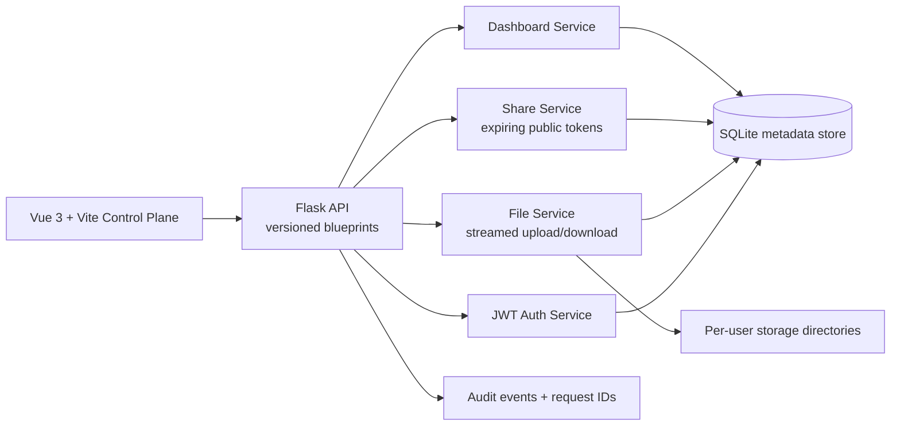
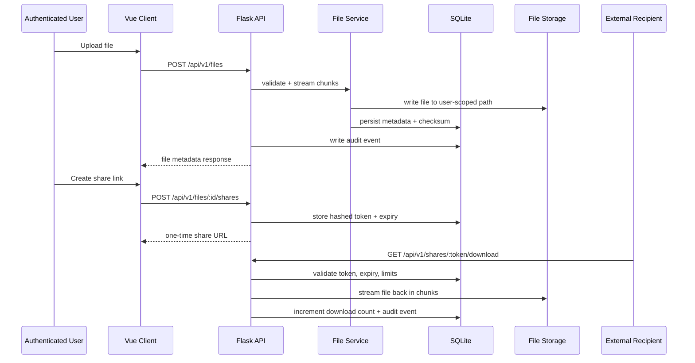

# VaultFlow Secure File Transfer

VaultFlow is a secure file transfer control plane for authenticated uploads, governed file sharing, and auditable external downloads.

## Why It Matters

Teams often need to share sensitive files outside their organization without emailing attachments, exposing internal credentials, or losing visibility into who downloaded what. VaultFlow focuses on that gap: controlled transfer, expiring access, and operational visibility in a lightweight system that still feels production-aware.

What makes it technically hard:

- uploads and downloads should stream instead of buffering entire files in memory
- external recipients need time-limited access without full user accounts
- file ownership, share policies, and audit events have to stay consistent
- the system needs enough operational signals to feel debuggable and extensible

## First Impression

### Key Features

- JWT-authenticated workspace for upload, download, delete, and dashboard actions
- Expiring share links with hashed tokens, download limits, and revocation
- Streamed transfer paths with SHA-256 metadata and ownership-scoped storage
- Audit feed and transfer metrics for user activity and file lifecycle visibility
- Rate limiting on login and upload paths to make abuse controls explicit

### Stack

- Backend: Flask, Flask-JWT-Extended, SQLAlchemy, SQLite
- Frontend: Vue 3, Vue Router, Vite, Axios
- Security and transfer model: JWT auth, expiring share links, checksum validation, request IDs
- Dev workflow: PowerShell launcher, Docker Compose, backend integration tests

### System Diagram



### Demo Flow

1. Start the stack with [Start-VaultFlow.ps1](./Start-VaultFlow.ps1).
2. Create sample files with [scripts/New-DemoFiles.ps1](./scripts/New-DemoFiles.ps1).
3. Register a user in the UI, upload one of the generated demo files, and observe checksum and metadata.
4. Create an expiring share link, copy it, and open it in a private browser window.
5. Revoke the share or consume its download budget and verify the public link no longer works.

## Architecture

### High-Level Architecture

VaultFlow separates request handling from orchestration. Flask blueprints define the API surface, service modules own transfer and auth logic, SQLAlchemy stores metadata and audit events, and file bytes are persisted on disk in user-scoped directories.

Key modules:

- `backend/app/api`: versioned HTTP endpoints
- `backend/app/services`: auth, transfer, share, dashboard, rate-limit, and audit orchestration
- `backend/app/models.py`: `User`, `FileRecord`, `ShareLink`, and `AuditEvent`
- `frontend/src/composables/useTransferWorkspace.js`: frontend workflow orchestration
- `frontend/src/components/workspace`: auth, upload, share, file table, and activity UI

### Request Flow



### Key Tradeoffs

- SQLite keeps the project easy to run and reason about, but it is not the right persistence layer for high-write, concurrent production workloads.
- Local disk storage makes the transfer path concrete and inspectable, but object storage would be a better fit for scale and durability.
- In-memory rate limiting is simple and dependency-light, but distributed deployments would need Redis or another shared limiter.
- Server-side encryption is documented as the baseline, while full envelope encryption is intentionally left as the next hardening step.

## Production Signals

VaultFlow includes several production-oriented behaviors already and calls out the ones that would be added next.

| Signal | Current State | Notes |
|---|---|---|
| Auth | Implemented | JWT sessions with protected routes and public share links for external access |
| Integration tests | Implemented | Backend tests cover auth, transfer lifecycle, sharing, and rate limiting |
| Env config | Implemented | Configurable secrets, share limits, upload limits, ports, and storage settings |
| Structured API envelopes | Implemented | Consistent success/error payloads with request correlation IDs |
| Transfer metrics | Implemented | Dashboard exposes file counts, storage bytes, download volume, and active shares |
| Audit trail | Implemented | Auth and transfer events are stored and rendered in the UI |
| Tracing | Partial | Request IDs exist; full distributed tracing is a future improvement |
| Structured logs | Partial | Logging is centralized, but not yet emitted as fully structured JSON |
| Retries | Limited | Browser retries are not automatic; idempotency and resumable transfers are future work |
| Graceful shutdown | Limited | Dev server flow is fine locally, but production deployment would move to Gunicorn/Uvicorn workers |
| Migrations | Missing | Schema is created automatically today; Alembic should replace this before real deployment |

## Design Decisions

- App-factory Flask backend: keeps config, testing, and route registration explicit.
- Service-oriented backend modules: separates HTTP transport from transfer and share logic.
- One-time share URL return: the plain token is only returned on creation; only the hash is stored.
- Streamed transfer path: upload and download code operate on chunks to avoid loading whole files into memory.
- User-scoped storage layout: each user owns an isolated storage subtree to simplify access control reasoning.
- Vite frontend: improves local startup speed and keeps the client tooling modern and lightweight.

## Failure Handling

- Invalid or expired JWTs return structured `401` responses.
- Expired, revoked, or overused share links are rejected before file streaming begins.
- Upload size limits are enforced server-side.
- Login and upload rate limits slow down noisy clients and brute-force attempts.
- Responses include request IDs to make debugging easier across client and server logs.

## How It Works

### Repo Layout

```text
secure-file-transfer/
|-- backend/
|   |-- app/
|   |   |-- api/
|   |   |-- core/
|   |   |-- services/
|   |   |-- utils/
|   |   |-- __init__.py
|   |   |-- extensions.py
|   |   `-- models.py
|   |-- tests/
|   |-- .env.example
|   |-- Dockerfile
|   |-- requirements.txt
|   `-- run.py
|-- frontend/
|   |-- src/
|   |   |-- components/
|   |   |-- composables/
|   |   |-- router/
|   |   |-- services/
|   |   |-- styles/
|   |   `-- views/
|   |-- .env.example
|   |-- Dockerfile
|   |-- package.json
|   `-- vite.config.js
|-- scripts/
|   `-- New-DemoFiles.ps1
|-- docker-compose.yml
`-- Start-VaultFlow.ps1
```

### Important API Routes

- `POST /api/v1/auth/register`
- `POST /api/v1/auth/login`
- `GET /api/v1/health`
- `GET /api/v1/dashboard`
- `GET /api/v1/files`
- `POST /api/v1/files`
- `GET /api/v1/files/<file_id>/download`
- `POST /api/v1/files/<file_id>/shares`
- `GET /api/v1/shares/<token>/download`
- `DELETE /api/v1/shares/<share_link_id>`
- `DELETE /api/v1/files/<file_id>`

## Run It

### Fastest Path

```powershell
.\Start-VaultFlow.ps1
```

Default local URLs:

- Frontend: `http://localhost:8081`
- Backend API: `http://localhost:5001`

### Manual Run

Backend:

```powershell
cd backend
python -m venv venv
venv\Scripts\activate
pip install -r requirements.txt
copy .env.example .env
python run.py
```

Frontend:

```powershell
cd frontend
npm install
copy .env.example .env
npm run dev
```

### Docker

```bash
docker compose up --build
```

### Demo Setup

Generate demo files:

```powershell
.\scripts\New-DemoFiles.ps1
```

Then:

1. Register a new account in the UI.
2. Upload one of the generated files from `demo-files`.
3. Create a share link and copy it.
4. Open the link in an incognito window.
5. Refresh the dashboard to see download count and audit activity update.

## Environment Configuration

- Backend defaults live in [backend/.env.example](./backend/.env.example)
- Frontend defaults live in [frontend/.env.example](./frontend/.env.example)

Important backend settings:

- `APP_SECRET_KEY`
- `JWT_SECRET_KEY`
- `PORT`
- `MAX_CONTENT_LENGTH_MB`
- `DEFAULT_SHARE_LINK_TTL_MINUTES`
- `LOGIN_RATE_LIMIT_ATTEMPTS`
- `UPLOAD_RATE_LIMIT_REQUESTS`
- `PUBLIC_BASE_URL`
- `CORS_ALLOWED_ORIGINS`

Important frontend settings:

- `VITE_API_BASE_URL`
- `VITE_PROXY_TARGET`

## Tradeoffs

- Simplicity over infrastructure depth: local storage and SQLite make the project easy to demo and test.
- Explicit operational behavior over abstraction: request IDs, rate limits, and share policies are easy to trace in code.
- Security posture over convenience: share links expire and are revocable, but the system does not yet support permanent public artifacts.
- Streaming over resumability: chunked file handling is present, but resumable multipart uploads are not.

## Limitations

- No resumable or multipart uploads for very large files
- No background job queue for long-running post-processing
- No object storage backend yet
- No database migration framework yet
- No full observability stack such as OpenTelemetry or Prometheus exporters
- No multi-node rate limiting or distributed session invalidation

## Future Improvements

### Next at Scale

- Replace local disk with S3-compatible object storage
- Replace SQLite with Postgres and add Alembic migrations
- Move rate limiting to Redis for shared enforcement
- Add envelope encryption with per-file data keys and KMS wrapping
- Add resumable uploads and partial-download support
- Add structured JSON logs, tracing, and metrics exporters
- Add background workers for scanning, retention policies, and notifications
